### 一、 本地环境与 OpenClaw 安装

这是最容易报错的一步，务必确保环境达标。

1. **检查 Node.js 版本**：打开终端，输入 `node -v`。必须确保版本是 **v22 或以上**（且 npm >= 10）。如果是旧版本，请务必先升级，否则安装会直接中断。
2. **执行一键安装**：
   - **Windows** (以管理员身份运行 PowerShell)： `iwr -useb https://openclaw.ai/install.ps1 | iex`
   - **macOS / Linux** (终端运行)： `curl -fsSL https://openclaw.ai/install.sh | bash`

如果一键安装不成功

```bash
# 0) 先切到符合要求的 Node（你在用 nvm）
# 设置 Node 镜像
nvm node_mirror https://npmmirror.com/mirrors/node/

# 设置 NPM 镜像
nvm npm_mirror https://npmmirror.com/mirrors/npm/

nvm install 22.12.0
nvm use 22.12.0

# Start-Process powershell -Verb runAs
npm config set proxy http://127.0.0.1:7890
npm config set https-proxy http://127.0.0.1:7890
# 1) 安装 openclaw
npm install -g openclaw@latest

# 2) 一键把“真正有 openclaw.cmd 的目录”加到用户 PATH，并刷新当前会话
$npmPrefix = (npm config get prefix).Trim()
$candidates = @($npmPrefix, (Join-Path $npmPrefix "bin"), (Join-Path $env:APPDATA "npm")) | Select-Object -Unique
$hit = $candidates | Where-Object { Test-Path (Join-Path $_ "openclaw.cmd") }

if (-not $hit) {
  Write-Host "未找到 openclaw.cmd，请先检查 npm 安装是否成功：" -ForegroundColor Red
  npm list -g --depth=0
} else {
  $userPath = [Environment]::GetEnvironmentVariable("Path","User")
  if ([string]::IsNullOrWhiteSpace($userPath)) { $userPath = "" }
  foreach ($p in $hit) {
    if (-not (($userPath -split ";") -contains $p)) { $userPath = "$userPath;$p" }
  }
  $userPath = ($userPath -split ";" | Where-Object { $_ } | Select-Object -Unique) -join ";"
  [Environment]::SetEnvironmentVariable("Path", $userPath, "User")
  $env:Path = [Environment]::GetEnvironmentVariable("Path","Machine") + ";" + $userPath
  Write-Host "PATH 已更新: $($hit -join ', ')" -ForegroundColor Green
}

# 3) 验证
where.exe openclaw
openclaw --version
openclaw onboard

```

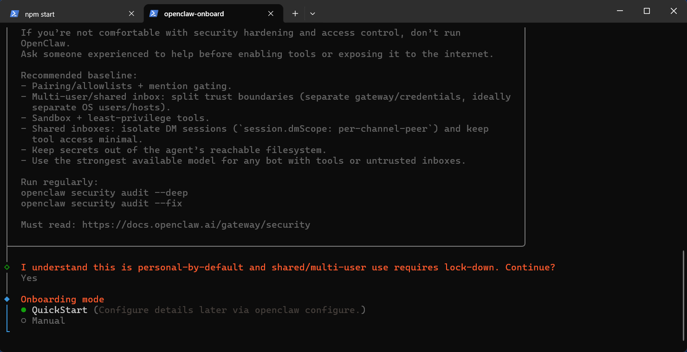


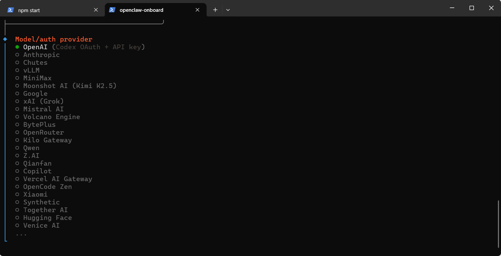

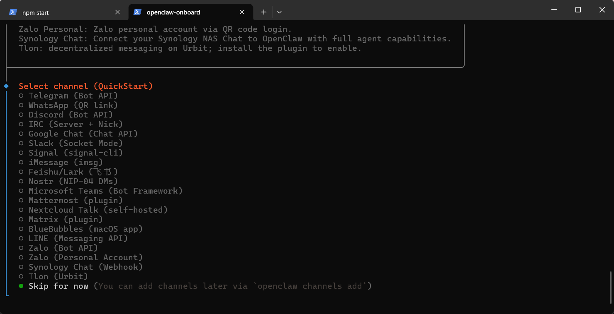

可以选择飞书


3. **初始化网关**：安装完成后，在终端运行 `openclaw onboard`。在向导中可以先选择“Skip for now”跳过大模型配置，先把基础服务和飞书通道跑通。

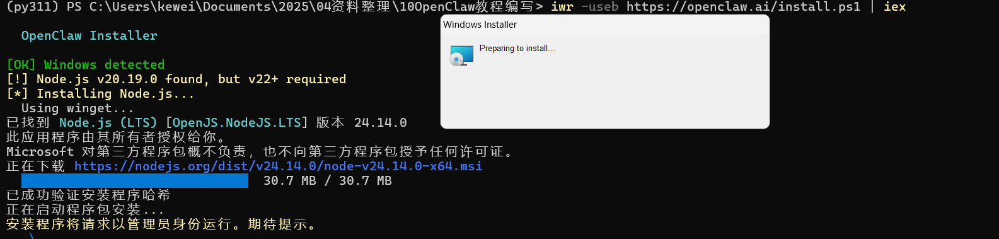

安装时，这里会要求管理员权限，所以说点确认即可。


### 二、 飞书端配置（打造交互入口）

这一部分的目标，是让飞书真正能把消息交给 OpenClaw，并且允许后续做私聊配对、文档读取和文件操作。

1. **创建应用**：登录飞书开放平台开发者后台https://open.feishu.cn/app，创建“企业自建应用”，记录下 **App ID** 和 **App Secret**。

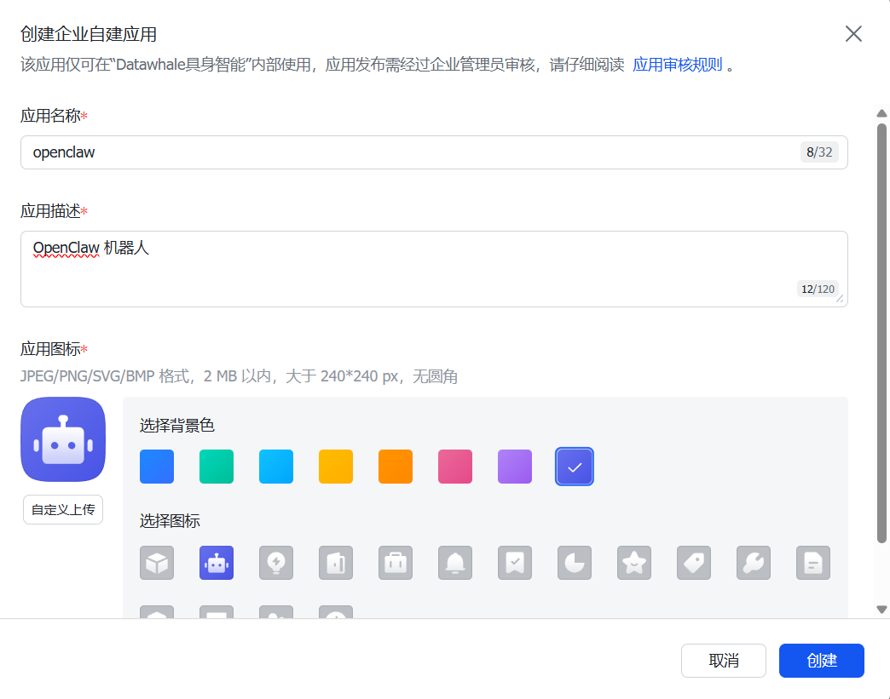

1. **启用机器人**：在“添加应用能力”中开启“机器人 (Bot)”。

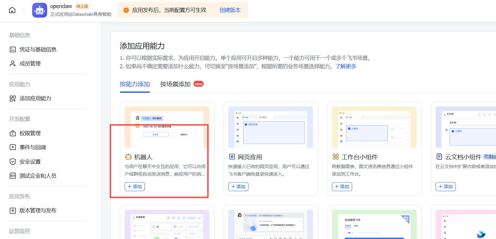

1. **配置核心权限**：在“权限管理”中搜索并添加这些关键权限。可以按三类来理解：
   - `im:` 相关权限：用于收发消息、机器人入群、私聊交互。
   - `contact:` 相关权限：至少要有联系人只读权限。实际排障中如果缺这个，OpenClaw 会报 `99991672`，导致私聊 pairing 能收到，但无法真正完成绑定。
   - `docs:` / `drive:` / `wiki:` / `bitable:` 相关权限：如果你希望后面让 OpenClaw 读写飞书文档、云盘、知识库、多维表格，这些权限要一起补齐。

   一个经验结论是：如果你已经能收到飞书里的 pairing code，但机器人就是不继续回复，优先检查 `contact:` 权限有没有真的开通并发布成功。

   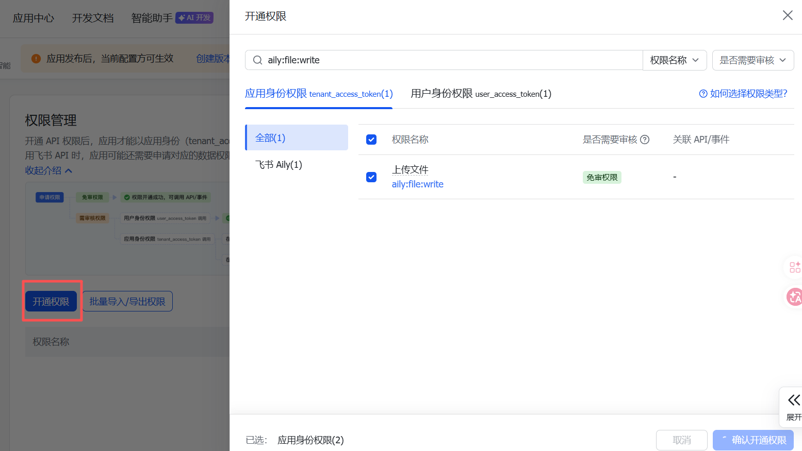

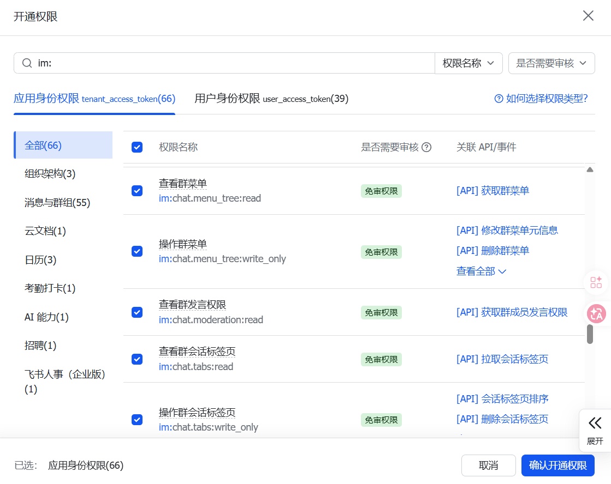

需要配置“事件与回调”，并把订阅方式改成**长连接（WebSocket）接收事件**。

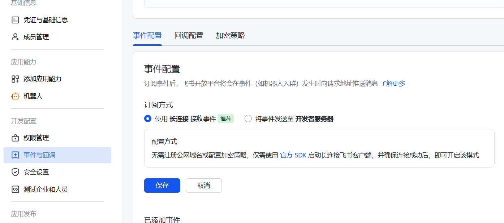


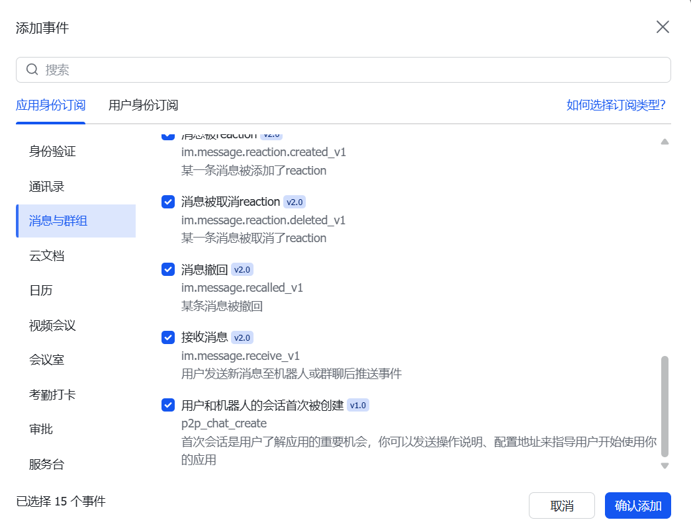

需要把消息相关事件加上，回调订阅方式同样选长连接。


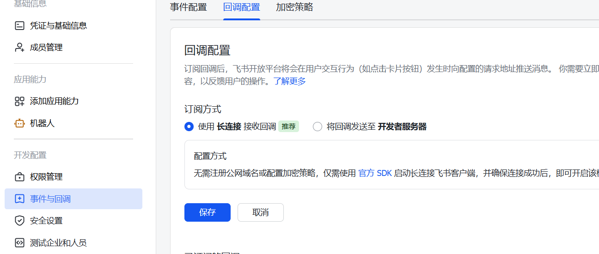


1. **发布版本**：在“版本管理与发布”中创建一个新版本并申请发布。


1. **绑定 OpenClaw**：回到本地终端，运行 `openclaw config`，选择 `Channels` -> `Feishu/Lark`，填入刚才的 App ID 和 Secret。随后执行 `openclaw gateway restart` 重启网关。

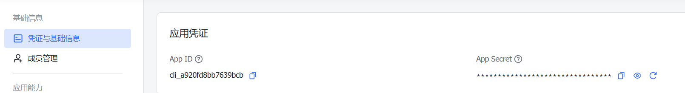


飞书收到申请之后可以打开应用

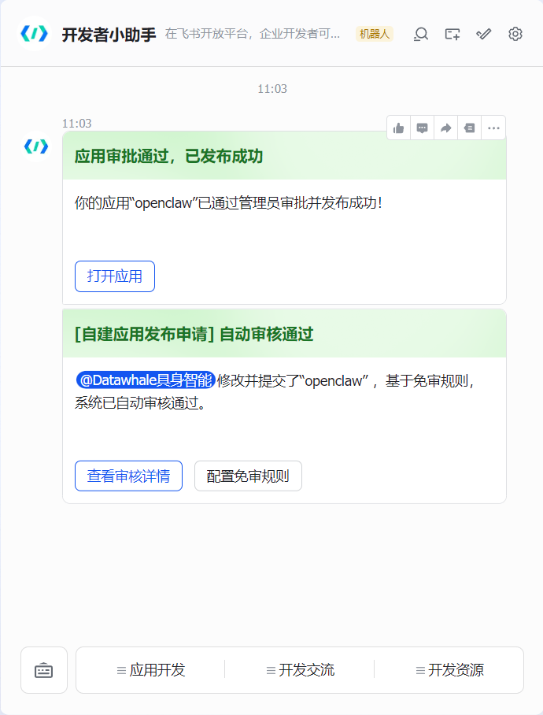


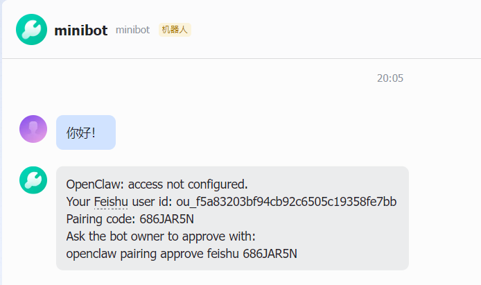


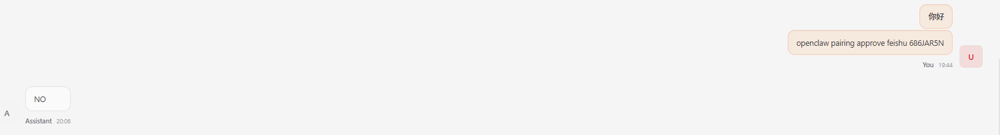


然后回到命令行，输入 App ID 和 App Secret。


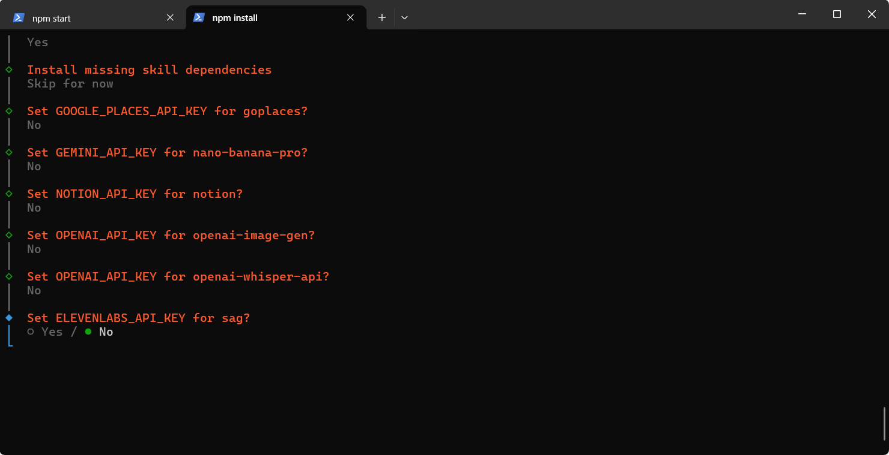


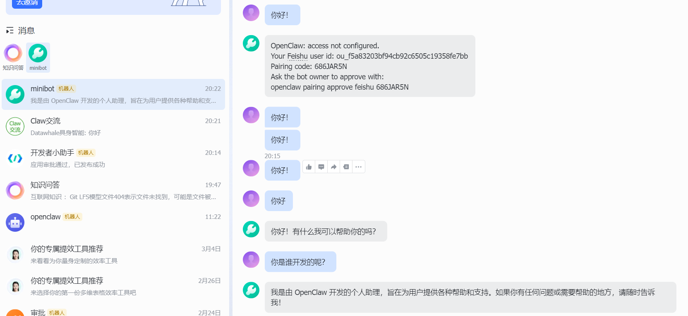


这些第三方模型、Skill、Hook 在第一次安装时都可以先选 `No` 或 `Skip for now`，先保证飞书消息链路跑通。

如果飞书私聊里已经收到了 pairing code，比如 `686JAR5N`，正确做法不是在飞书里让模型“帮你批准”，而是回到本机命令行执行：

```bash
openclaw pairing list
openclaw pairing approve 686JAR5N
```

执行完成后，如果 `openclaw pairing list` 显示没有 pending 请求，说明私聊绑定这一步才算真的完成。


你接下来这样用最稳：

```
# 每次开机后，普通权限启动（不需要管理员）
openclaw gateway run 
```

保持这个窗口别关，再在另一个窗口执行：

```
openclaw gateway probe
openclaw dashboard 
```

如果你想要“后台常驻自动启动”（不手动 `run`），需要管理员 PowerShell：

```
openclaw gateway install --force
openclaw gateway start
```


如果需要重新验证 `Codex`

```
openclaw onboard --accept-risk --flow quickstart --mode local --auth-choice openai-codex --skip-channels --skip-skills --skip-daemon --skip-health --skip-ui

openclaw models status --json


# 如果你是 HTTP 代理
$env:HTTP_PROXY="http://127.0.0.1:7890"
$env:HTTPS_PROXY="http://127.0.0.1:7890"

# 如果你是 SOCKS5（按需二选一）
# $env:ALL_PROXY="socks5://127.0.0.1:7890"

# 关键：本地回调不要走代理
$env:NO_PROXY="localhost,127.0.0.1,::1"

openclaw onboard --accept-risk --flow quickstart --mode local --auth-choice openai-codex --skip-channels --skip-skills --skip-daemon --skip-health --skip-ui

```


### 三、 接入代理 API（当前更推荐 hiapi，SiliconFlow 作为可选）

这一部分建议单独看成“模型提供商配置”。如果你只是想先把 OpenClaw 跑通，我更推荐直接用一个已经验证可用的 OpenAI-compatible 代理。当前这套环境里，`hiapi` 这条链路已经验证成功；`SiliconFlow + DeepSeek` 这条链路在我这次排障里没有稳定跑通，所以更适合放在“可选方案”。

1. **当前更推荐的稳定方案（hiapi）**：
   - **API Base URL**：`https://hiapi.online/v1`
   - **推荐主模型**：`gpt-4o-mini`
   - **推荐 fallback**：`gpt-5-mini`
   - **环境变量**（Windows PowerShell）：

```powershell
[Environment]::SetEnvironmentVariable("HIAPI_API_KEY","你的 key","User")
[Environment]::SetEnvironmentVariable("HIAPI_BASE_URL","https://hiapi.online/v1","User")
```

   然后在 `openclaw configure` 里选择 `OpenAI-compatible` 或 `Custom Provider`，填入上面的 Base URL、API Key 和 Model ID 即可。

2. **SiliconFlow 作为可选方案**：
   - **Provider**: 选择 `OpenAI-compatible` 或 `Custom Provider`。
   - **API Base URL**: 填写 `https://api.siliconflow.cn/v1`。
   - **API Key**: 填入你生成的 `sk-...` 密钥。
   - **Model ID**:
     - 日常问答、文字润色、简单脚本：`deepseek-ai/DeepSeek-V3`
     - 复杂 Bug 排查、深度逻辑推理：`deepseek-ai/DeepSeek-R1`

   但这条路线建议先在命令行或 Postman 里独立验证 `/v1/chat/completions` 能否正常返回，再接 OpenClaw。

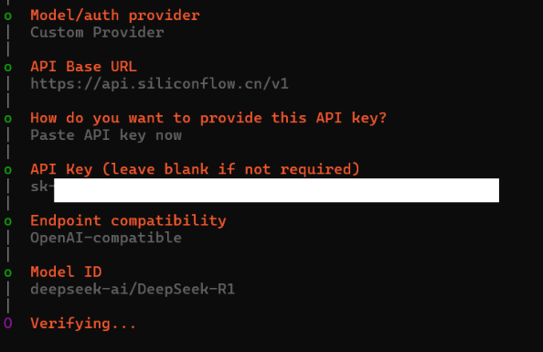

------

### 四、 目前这套配置建议保留什么

如果你已经像本文这样把 OpenClaw 跑通，当前最值得保留的是下面这几项：

1. **飞书通道配置**
   - App ID / App Secret 已写入 OpenClaw。
   - 飞书权限、长连接事件、版本发布都已经完成。
   - 如果以后换新的飞书应用，记得同步更新环境变量和 `openclaw configure`。

2. **模型配置**
   - 当前更稳的是 `hiapi/gpt-4o-mini`
   - fallback 可以保留 `hiapi/gpt-5-mini`
   - 不建议把一堆失效的 provider 混在一起，否则排障时很容易误判。

3. **运行方式**
   - 日常使用：`openclaw gateway run`
   - 检查状态：`openclaw gateway probe`
   - 打开控制台：`openclaw dashboard`

4. **私聊配对**
   - pairing code 要在本机执行 `openclaw pairing approve <code>`，不要直接在飞书里让模型“口头批准”。

### 五、 落地实战体验

这套工作流在本地跑通后，OpenClaw 就不只是一个聊天机器人了，而是拥有本地执行与文件读写权限的超级助手。

举个实际场景：当你在编写教程，或者在项目中调试机械臂的视觉识别代码时，如果遇到棘手的环境配置报错。你不需要在编辑器和浏览器之间来回复制粘贴。你可以直接在飞书里对 OpenClaw 说：“帮我看一下项目目录下最新的错误日志，定位一下是不是计算机视觉库的依赖冲突，并帮我修改一下配置文件。”

